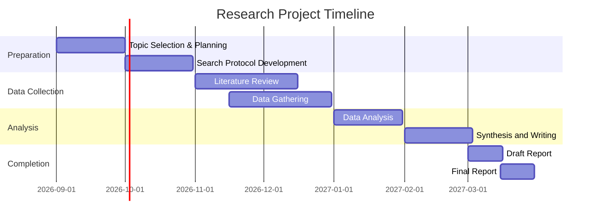

# Proposed Research Plan for an Unspecified Topic

## Executive Summary  
This document outlines a generic framework for conducting a **deep research project** when the exact subject is not yet determined. It proposes a systematic approach: first defining a set of possible themes, then formulating focused questions and methods, and finally planning data collection, analysis, and reporting. A well-crafted research plan serves as a roadmap, detailing objectives, methods, and expected outcomes to ensure a focused, efficient investigation. Key elements include generating 3–5 candidate topics, prioritizing questions, establishing methodology (e.g. literature review, quantitative and qualitative analysis), and outlining timelines and deliverables. This plan also identifies gaps and uncertainties and recommends next steps for project initiation and iteration.

- **Scope & Topics:** Define the overall domain broadly, then propose 3–5 distinct research topics (e.g. *AI ethics in healthcare*, *climate adaptation in agriculture*, *pandemic preparedness*, *digital education*).  
- **Research Questions:** For each topic, draft specific, “FINER” questions (Feasible, Interesting, Novel, Ethical, Relevant) by first identifying the subject of interest and then narrowing the focus.  
- **Methodology:** Plan a mixed-methods approach: a systematic literature review across multiple databases, supplemented by data analysis (surveys, statistics) and interviews or case studies as needed.  
- **Key Findings:** (Planned) Synthesize existing knowledge by summarizing trends, consensus, and disagreements in recent studies. Identify what data and metrics are available (e.g. quantitative indicators, survey results) and note limitations in current evidence.  
- **Gaps & Uncertainties:** Highlight known gaps (e.g. lack of data for certain populations, rapidly evolving contexts) and assumptions (e.g. stability of technology, policy timelines) that add uncertainty.  
- **Implications & Recommendations:** Based on findings, recommend policy, practice, or further research directions. Even at this stage, outline how results might influence stakeholders.  
- **Next Steps:** Include refining topic selection, finalizing research questions, initiating literature search, and scheduling the research timeline (see timeline below).  

This structured plan ensures all stages of the research—from topic selection to deliverables—are transparent and methodical. A research plan is more than a formality; it ensures focus and organizes activities to achieve the objectives.

## Scope Definition and Potential Topics  
Given the undefined nature of the query, the first task is *scope definition*: brainstorming and prioritizing several plausible research themes. For illustration, we suggest the following example topics (to be finalized later):

| **Potential Topic**                          | **Key Questions**                                                                                  | **Primary Sources/Data**                                            | **Approx. Timeline**           |
|----------------------------------------------|----------------------------------------------------------------------------------------------------|---------------------------------------------------------------------|--------------------------------|
| **AI in Healthcare** *Ethics & Policy*     | • How do current AI systems affect patient privacy and outcomes? • What regulations govern clinical AI?  | • Academic journals (e.g. *Nature Medicine*, *AI & Society*) • WHO/NIH/White House AI reports • Industry case studies (IBM, Google Health)   | 3–6 months (iterative stages) |
| **Climate Resilience in Agriculture**        | • What adaptation strategies have proven effective for farmers? • How is climate data used in local planning? | • IPCC and UNFAO reports • Agricultural research journals • National climate/data portals (NOAA, NASA)  | 4–8 months               |
| **Pandemic Preparedness** (*Health Policy*) | • What lessons from COVID-19 can improve future readiness? • How do investment levels in health infrastructure correlate with outcomes? | • WHO/CDC/ECDC documents • *The Lancet* and public health journals • Government budgets and NGO reports   | 3–6 months               |
| **Digital Education Technologies**          | • Which technologies improve learning equity and outcomes? • What barriers exist for schools (infrastructure, training)? | • UNESCO/UNICEF education reports • *Educational Technology* journals • School district pilot studies and EdTech vendor analyses | 3–5 months               |

Each topic above is illustrative. In practice, we would refine or replace them based on stakeholder input. For each theme, we list a few guiding questions and likely sources. The timeline is very approximate and will be adjusted after finalizing the scope.

## Prioritized Research Questions  
After selecting one or more topics, the next step is **framing precise research questions**. This usually follows a stepwise approach: start broad, then narrow focus. For example:

- *For the AI in Healthcare topic:*  
  - **RQ1:** What are the most significant privacy and bias issues reported in AI-driven diagnostics?  
  - **RQ2:** How do current international regulations address AI in patient care?  

- *For Climate Resilience:*  
  - **RQ1:** Which adaptation strategies (e.g. irrigation, crop diversification) correlate with improved yield in climate-stressed regions?  
  - **RQ2:** How do smallholder farmers incorporate climate forecasts into planning?  

- *For Pandemic Preparedness:*  
  - **RQ1:** What best practices emerged for early pandemic detection and response?  
  - **RQ2:** How do different countries’ healthcare spending levels relate to pandemic mortality rates?  

- *For Digital Education:*  
  - **RQ1:** What tech-enabled interventions (e.g. MOOCs, blended learning) have demonstrably reduced achievement gaps?  
  - **RQ2:** Which factors (internet access, teacher training) most limit EdTech adoption in low-resource schools?  

These questions are examples; the goal is to **identify the unknowns** that the research will address. A good research question *“forms the backbone”* of the study, defining the problem and guiding the methodology. We would prioritize questions based on significance, feasibility, and stakeholder needs.

## Methodology  
The methodology combines a **systematic literature review** with targeted data collection and analysis:

- **Literature Review:** Conduct a systematic search across multiple academic and industry databases (e.g. Scopus, Web of Science, IEEE Xplore). Use well-defined keywords derived from the research questions, and apply inclusion/exclusion criteria (e.g. publication date within last 10 years, peer-reviewed sources). This follows best practices for rigorous evidence gathering. We will chart the findings to identify consensus vs. disagreement and research gaps.

- **Quantitative Data Analysis:** Depending on topic, gather relevant datasets or statistics. For example, if studying healthcare AI, we may collect health outcome data or AI usage statistics from official databases (WHO, FDA, CMS). For climate/adaptation, use meteorological and yield datasets (NASA, FAO). Data will be analyzed using statistical or computational models to answer our questions.

- **Qualitative Research:** Supplement numeric data with expert interviews, surveys, or case studies. For instance, interviewing policymakers on AI regulations or surveying teachers about EdTech barriers. This mixed-methods approach ensures a holistic view.

- **Analysis Plan:** Data and literature will be synthesized thematically. If feasible, we might perform meta-analysis or comparative case analysis. Visualizations (charts, maps) will be used to illustrate trends.

Throughout, we will document methods and decisions. If the project scope expands, we may iterate back to refine questions. The plan will remain flexible but structured – for example, phasing tasks by quarter and allowing buffer time for unexpected developments.

## Preliminary Literature Insights (Anticipated)  
Although the topic is not finalized, we expect to find the following general patterns in recent literature:

- **Current State:** For each potential topic, identify key findings. For example, AI research may emphasize algorithmic fairness and data privacy; climate research shows emerging sensor networks for adaptation; pandemic studies highlight surveillance vs. civil liberties; EdTech literature notes digital divides.

- **Consensus and Controversy:** Literature often contains both broad agreements (e.g., climate change impacts on yields) and debates (e.g., regulation level for AI). We will note these areas. 

- **Historical Data & Metrics:** We will catalog relevant metrics (e.g. infection rates, temperature anomalies, test scores, etc.) used by others. 

As the systematic review proceeds, we will extract and tabulate data to compare studies. This will reveal **gaps** (questions not yet answered or data not collected). Identifying these gaps is a core outcome of the review.

## Data and Metrics to Collect  
Key data/metrics will be chosen based on the refined topic and questions. In general:

- **Quantitative Metrics:** These might include statistics like incidence/prevalence rates, performance measures (accuracy of AI systems, crop yield changes), adoption percentages, economic indicators (GDP % in R&D), or other domain-specific KPIs. Reliable sources include official statistics agencies (e.g. World Bank, WHO, national bureaus).

- **Qualitative Data:** Testimonial or descriptive data from interviews, policy documents, or case studies. For example, policy analysis of governmental reports or summarized responses from expert surveys.

- **Benchmarks and Standards:** We will note any industry benchmarks or standards (e.g. ISO standards for AI, international climate goals) that frame the problem.

Data quality and availability will be assessed. We will prefer **recent, high-quality sources** (last 5–10 years) and triangulate data where possible.  

## Gaps and Uncertainties  
Even a thorough review may leave some uncertainties:

- **Data Gaps:** Some regions or populations may lack data. For example, rural areas in developing countries might not report tech usage rates or climate impacts. 

- **Rapid Change:** Topics like AI or COVID-19 evolve quickly, so research can become outdated. Ongoing developments (new regulations, emerging variants) are uncertainties.

- **Conflicting Findings:** Studies may disagree (e.g. on effectiveness of particular education tools). We will highlight these and consider methodological differences.

- **Assumptions:** We will document assumptions (e.g. stable funding, constant policy environments) that underpin projections or models.

Recognizing gaps informs both the framing of final conclusions and future research needs.

## Implications and Recommendations  
Though outcomes will depend on the selected topic, we can outline how the results **might be used**:

- **Policy Impact:** Findings could inform policymakers (e.g. proposing regulations or investment priorities). For example, if studying healthcare AI, recommendations might include guidelines for data governance.

- **Industry Practice:** Results may help organizations adopt best practices (e.g. tech companies implementing ethical frameworks, schools adopting proven EdTech methods).

- **Research Agenda:** Gaps uncovered will lead to suggestions for further studies (new experiments, longitudinal tracking).

Each recommendation will tie back to evidence uncovered. This ensures the research is actionable and relevant.

## Next Steps  
To initiate this plan, we will:

1. **Finalize Topic Selection:** Engage stakeholders (sponsor, domain experts) to choose and possibly narrow one of the candidate topics.  
2. **Refine Questions and Scope:** Based on the chosen theme, adapt the preliminary questions above and set explicit inclusion criteria.  
3. **Assemble Resources:** Gather key databases, access needed subscriptions, and obtain any required permissions for data collection.  
4. **Conduct Pilot Searches:** Test keyword queries in academic databases to refine search strategy and estimate literature size.  
5. **Schedule Milestones:** Develop a detailed timeline (see below) with deadlines for each phase, assigning responsibilities if a team is involved.

Throughout, we will document our process. Regular progress reviews will help adjust scope or methods as needed.

## Proposed Topic Comparison Table  
The table below compares example topics, illustrating how focus areas, sources, and timelines might vary:

| **Research Theme**           | **Example Research Questions**                                                                 | **Key Sources to Consult**                                                       | **Rough Timeline**              |
|------------------------------|----------------------------------------------------------------------------------------------|----------------------------------------------------------------------------------|---------------------------------|
| **AI Ethics in Healthcare**  | • How do AI systems impact patient outcomes and privacy? • What regulatory frameworks exist globally? | Government health agencies (WHO, FDA), *Journals of AI/Health Informatics*, tech policy think tanks | 3–6 months (iterative)         |
| **Climate Resilience (Agri.)** | • What adaptation methods increase crop resilience? • How do small farmers use climate data? | IPCC/UN FAO reports, *Agricultural Science* journals, climate data centers (NOAA, Copernicus)       | 4–8 months                     |
| **Pandemic Preparedness**    | • What best practices improve early outbreak detection? • How effective were past public health interventions? | WHO/CDC guidelines, *The Lancet* articles, government epidemic response case studies               | 3–6 months                     |
| **EdTech in Education**      | • Which digital tools improve learning in low-resource settings? • What barriers limit tech adoption? | UNESCO/World Bank education reports, *Educational Tech* journals, NGO pilot study reports            | 3–5 months                     |

*Table: Example research themes, associated questions, typical sources, and indicative timelines.* (Timelines include literature review, data collection, analysis, reporting phases.)  

## Prioritized Sources to Consult  
The following types of sources will be prioritized:

- **Academic Journals and Conferences:** Leading, peer-reviewed outlets relevant to the topic (e.g. *Nature/Science* for broad issues; IEEE or discipline-specific journals). As recommended, a systematic search should draw from multiple databases and top journals.
- **Official and Government Publications:** Reports and data from authoritative bodies (e.g. UN agencies, national statistics offices, regulatory agencies like FDA, EPA, WHO) to obtain validated data and policy insights.
- **Industry and NGO Reports:** White papers and case studies from reputable organizations (e.g. McKinsey, Gartner, Gates Foundation) that often contain up-to-date analyses and sometimes proprietary data.
- **Conference Proceedings and Preprints:** Especially for rapidly evolving fields (AI, biotech), we will check recent conference papers and preprint servers (ArXiv, medRxiv), then verify if later published in journals.
- **Data Repositories:** Domain-specific datasets (e.g. World Bank Data, Kaggle datasets, clinical trial repositories) for quantitative analysis.

We will focus on *recent* sources (typically past 5–10 years) and cross-validate any critical data points. Source credibility will be assessed (e.g. peer-review status, authors’ expertise) to ensure reliability.

## Timeline and Deliverables  
A tentative project timeline (assuming start in September 2026) is:

- **Sept–Oct 2026:** Finalize topic, refine questions, pilot literature searches. *Deliverable:* Research scope document and search protocol.  
- **Oct–Dec 2026:** Comprehensive literature review and data gathering. *Deliverable:* Annotated bibliography and data inventory.  
- **Jan–Feb 2027:** Data analysis and synthesis of findings. *Deliverable:* Interim report with key findings and visualizations (charts, tables).  
- **Mar 2027:** Draft final report, including discussion of gaps, implications, and recommendations. *Deliverable:* Draft final report.  
- **Apr 2027:** Revision and finalization. *Deliverable:* Final report and presentation deck.

*Figure: Example Gantt chart of research phases and timeline (subject to adjustment).*  

At each milestone, we will review progress to ensure quality and adjust the plan as needed. Primary deliverables include the final report (with citations and visualizations), a slide deck for stakeholders, and any assembled datasets or code.

---

**Sources:** Authoritative guides on research planning and methodology were used to inform this framework. These emphasize the importance of clear questions, rigorous literature search, and structured timelines in a successful research plan.