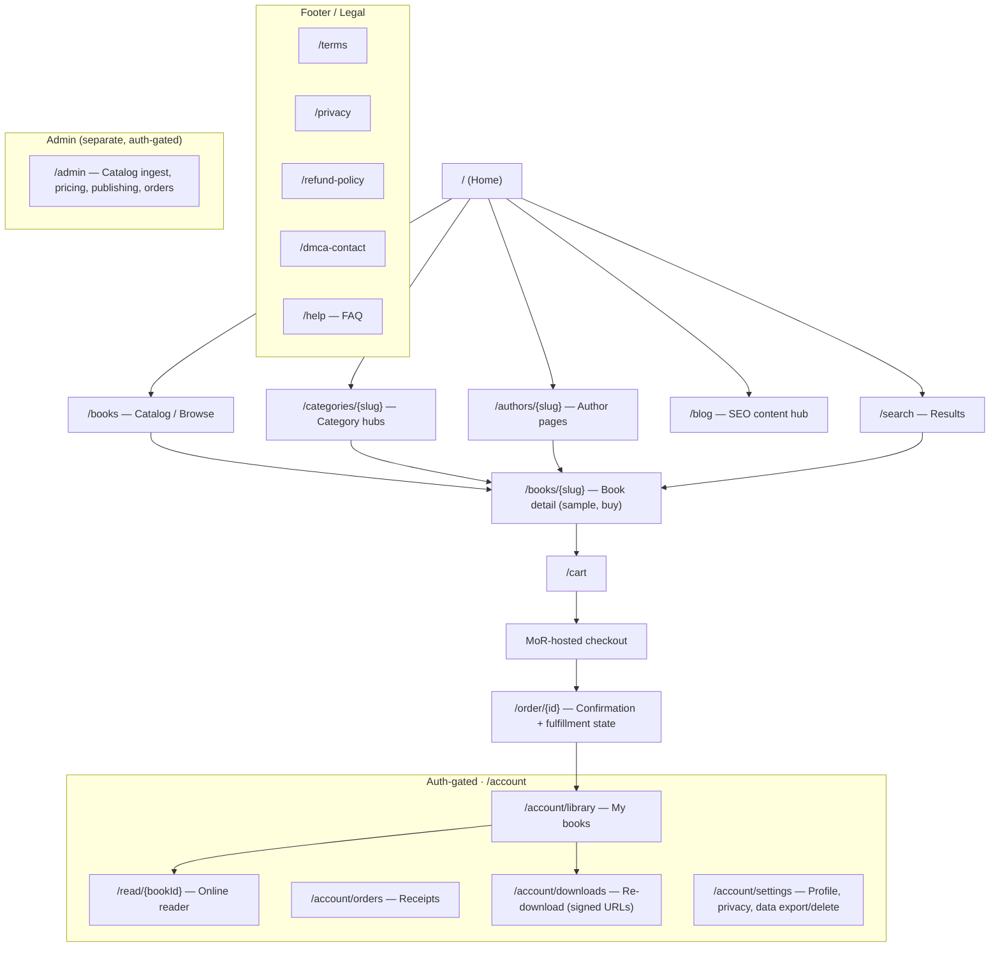
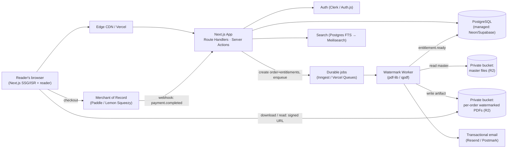
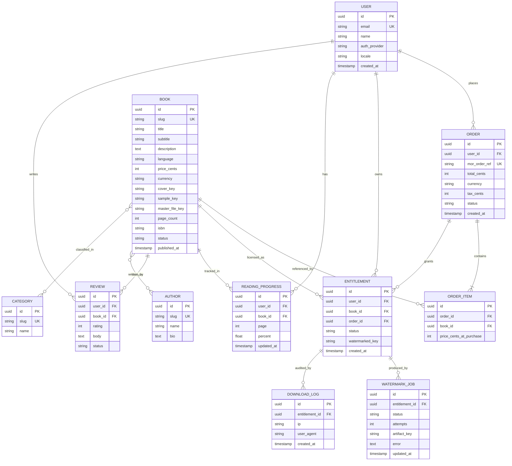
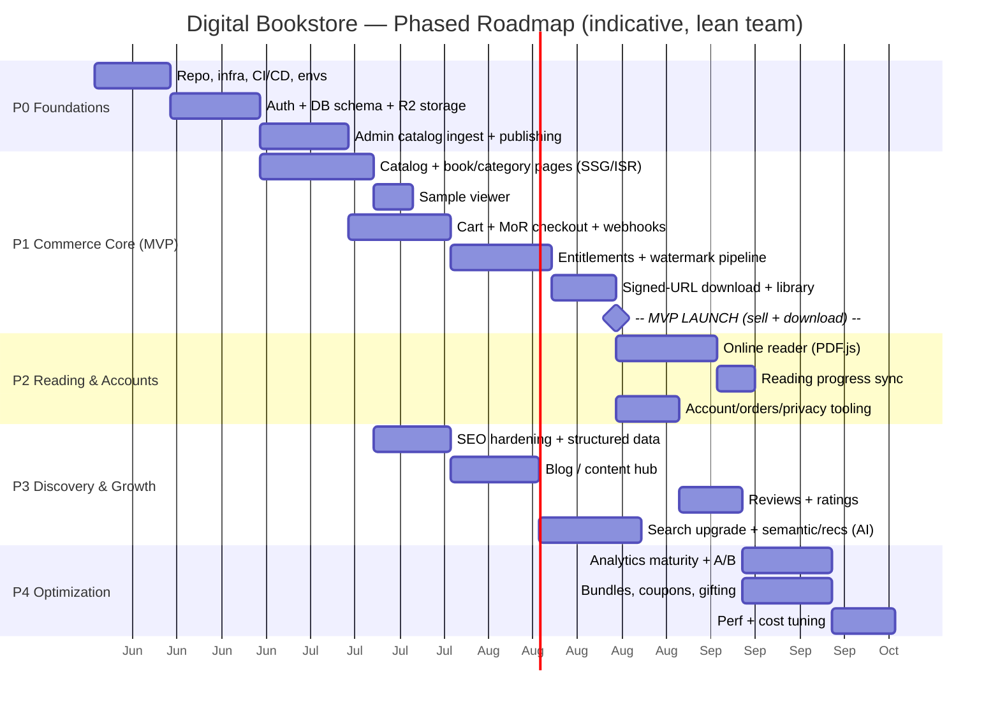

# Digital Bookstore — Enterprise Product & Architecture Roadmap

> **Product:** A web-based platform for selling digital books — downloadable as PDFs and readable online.
> **Generated by:** `enterprise-product-architect` v1.0 · **Date:** 2026-05-28
> **Locked Phase-0 decisions:** First-party catalog · One-time purchase (à la carte) · Social-DRM watermarking · B2C global.
> **Certainty legend:** `[FACT]` provided/verifiable · `[ASSUMPTION · confidence · sensitivity]` inferred · `[RECOMMENDATION · confidence]` guidance.

---

## Complexity Tier (Right-Sizing)

**Tier 2 — Mid-complexity transactional content platform.** More than a brochure site (real commerce, accounts, entitlements, secure file delivery, an online reader), but far less than a hyperscale marketplace (no seller onboarding, payouts, royalty ledgers, or subscription metering).

The plan therefore targets a **modular monolith on managed/serverless infrastructure** and *deliberately rejects*: microservices, self-hosted infra, hard DRM, multi-region active-active databases, and a custom payments/tax stack. Each rejection is justified in its ADR. The one place we spend "extra" complexity early is the **async watermarking pipeline** and **SEO rendering strategy** — because those are, respectively, the product's trust mechanism and its growth engine.

---

## 1. Executive Summary

A global, English-first, first-party digital bookstore. Readers discover titles through SEO-optimized book pages, buy individual books once (perpetual ownership), then **download a personally-watermarked PDF and/or read online**. Because the catalog is first-party and à la carte, the hard problems are **discovery (SEO), trust (it is a paid digital file), and frictionless-but-protected delivery (watermark + reader)** — *not* marketplace mechanics.

**Five most decision-critical conclusions:**

1. **[RECOMMENDATION · High]** Sell through a **merchant-of-record (MoR)** — Paddle or Lemon Squeezy — not raw Stripe. For a lean team selling worldwide, the MoR absorbs global VAT/sales-tax registration & remittance, PCI scope, and much fraud liability. This single choice eliminates your largest compliance risk. *(ADR-2)*
2. **[RECOMMENDATION · High]** Implement social DRM as **per-order pre-watermarked PDF artifacts delivered via short-lived signed URLs**, produced by an **async worker on the purchase webhook**. The master file never leaves private storage; re-downloads are instant. *(ADR-3)*
3. **[RECOMMENDATION · High]** Build the storefront on **Next.js (App Router)** with **SSG/ISR book pages** — justified by SEO economics (organic discovery is the growth engine), not framework hype. *(ADR-1)*
4. **[RECOMMENDATION · Med]** Store and serve book files from **zero-egress object storage (Cloudflare R2)**, not a per-GB-egress store. Selling downloads = sustained egress; this is a structural cost decision, not a detail. *(ADR-6)*
5. **[RECOMMENDATION · Med]** The sharpest *non-obvious* risk is **privacy, not piracy.** Embedding a buyer's identity into a file that then leaves your control is GDPR-relevant PII. Watermark with **name + order-ID** (email resolved server-side), disclose it, and put it under a retention policy. *(§11, R2 in register)*

**North Star Metric:** **Weekly Active Paying Readers** — unique users who complete ≥1 purchase *and* open the book (download or reader) within the week. It couples acquisition to realized value and is the leading indicator of repeat purchase.

---

## 2. Discovery & Clarified Assumptions

### 2.1 Confirmed facts

| # | Statement | Type |
|---|-----------|------|
| F1 | Books are supplied **first-party** (you own/license the catalog) | `[FACT]` |
| F2 | Monetization = **one-time purchase per book** (perpetual ownership) | `[FACT]` |
| F3 | Content protection = **social DRM** (per-buyer watermarking) | `[FACT]` |
| F4 | Audience = **B2C, global** | `[FACT]` |
| F5 | Delivery = **downloadable PDF AND online reading** | `[FACT]` |

### 2.2 Gap-filling assumptions (high-sensitivity items drive the whole plan)

| # | Assumption | Conf. | Sens. | If wrong → |
|---|-----------|:----:|:----:|-----------|
| A1 | Lean founding team / startup budget; **buy-over-build**, managed services | Med | **High** | A funded team could self-host, build custom DRM, run Stripe + own tax ops |
| A2 | You hold full distribution rights; **no publisher hard-DRM mandate** | High | **High** | A publisher mandate flips ADR-3/4 to **hard DRM (Readium LCP)** — major rework |
| A3 | Launch scale modest (10²–10³ titles, 10³–10⁴ customers) but **SEO traffic must scale to millions of pageviews** | Med | Med | Hyperscale changes caching/CDN/DB sizing, not the architecture's shape |
| A4 | Source files are **fixed-layout PDF**, not reflowable EPUB | High | Med | Reflowable content favors an EPUB reader (Readium/Foliate) — changes ADR-4 |
| A5 | Compliance scope = GDPR/CCPA + global consumption tax (via MoR); **no direct PCI burden** | Med | Med | A regulated niche or self-hosted payments adds obligations |
| A6 | Typical file sizes ~1–50 MB | Med | Low | Very large/media-rich files push toward chunked/tiled delivery |
| A7 | Stack is **open** (Next.js/Vercel recommended, not mandated) | Med | Med | An existing-stack constraint re-picks ADR-1/5/6 |

**Confirm before build start: A1 (team/budget), A2 (rights & DRM mandates), A3 (scale trajectory)** — the assumptions most likely to rewrite §8–§12.

### 2.3 Missing requirements surfaced proactively
Refund policy for digital goods (chargeback exposure) · sample/preview strategy (trust + conversion) · accessibility commitment (WCAG **and** PDF accessibility) · DMCA/takedown process (light now, mandatory if you ever go hybrid) · data-retention & deletion (GDPR) for watermark PII · age/region content restrictions if any titles warrant them.

---

## 3. Product Vision & Strategy

- **Mission:** Make buying and reading a digital book as fast and trustworthy as buying a song — instant access, true ownership, no DRM handcuffs.
- **Vision:** The default destination for readers who want to *own* (not rent) clean, well-presented digital books in your niche.
- **Target users `[ASSUMPTION · Med · Med]`:** intent-driven readers of nonfiction / technical / niche-fiction who arrive via search for a specific topic or title; they value convenience, presentation, and ownership over rock-bottom price.
- **Pain points addressed:** scattered/untrustworthy sources for paid PDFs; DRM that breaks reading and device-switching; no "read it now online" option; poor discovery of niche titles; opaque "do I actually own this?" anxiety.
- **Value proposition:** *"Find it, own it, read it anywhere — watermarked, never locked."*
- **Positioning:** premium, frictionless, trust-first — the opposite of both sketchy PDF sites and DRM-heavy incumbents.
- **Differentiation & competitive edge:** (1) no-lock-in ownership as an explicit promise; (2) read-online *and* download from one purchase; (3) editorial presentation quality (covers, samples, descriptions) that makes a single-catalog store feel curated; (4) speed — SSG pages + instant fulfillment.
- **Market assumptions `[ASSUMPTION · Med · Med]`:** competing against Gumroad/Leanpub (creator-led), publisher webstores, and informal PDF sharing. Your wedge is *curation + ownership clarity + reading experience* within a focused niche, not breadth.

> **ADR-0 · Strategic focus: niche-first, not catalog-breadth-first**
> **Decision:** Win a focused vertical/topic before broadening. **Rationale:** First-party means you bear acquisition/licensing cost per title; breadth is expensive and dilutes SEO authority. **Alternatives:** broad general store (capital-heavy, weak SEO authority early). **Tradeoffs:** smaller TAM short-term vs. defensible ranking + brand. **Risks:** niche too small. **Not the right choice when:** you already hold a large licensed catalog. **[RECOMMENDATION · Med]**

---

## 4. Business Model & Monetization

- **Model:** first-party retail of digital goods; revenue = (sale price − COGS/licensing − MoR fee − infra). No marketplace take-rate, no subscription liability.
- **Pricing logic `[RECOMMENDATION · Med]`:** value/tiered per title (e.g., short guide vs. full reference), not a single flat price. Display in buyer's currency via MoR; charge in a base currency to avoid FX-reconciliation overhead early.
- **Revenue streams (sequenced):**
  1. **Primary — per-book sales** (MVP).
  2. **Bundles / collections** (V1) — higher AOV, merchandising lever.
  3. **Coupons / launch & seasonal promos** (V1) — acquisition + email capture.
  4. **Gifting** (V2) — gift a book to another email; expands reach.
  5. *Deferred:* an optional all-access subscription — **explicitly out of scope** (contradicts the locked à-la-carte model; revisit only with data).
- **Unit economics `[ASSUMPTION · Low · High]`:** *illustrative, must be validated.* Sale $15 → MoR fee ~5%+$0.50 ≈ $1.25 → licensing/royalty (varies) → infra per sale (storage+egress+watermark compute) ≈ <$0.10. Gross margin is high once licensing is covered; **CAC vs. organic-SEO share is the real economic question** — repeat-purchase rate and SEO efficiency, not per-unit cost, determine viability.
- **Growth strategy:** SEO-led organic acquisition (cheap, compounding) + email lifecycle (post-purchase, new-release, bundle) + selective paid retargeting once funnels are instrumented. Repeat purchase is the flywheel — the library/account is the retention surface.

---

## 5. UX & User Journey Strategy

**Primary journeys**

1. **Discover → Buy (cold, from search):** SERP → book detail page → open sample → add to cart / buy → MoR checkout → confirmation → "your book is ready" (download + read).
2. **Read (post-purchase):** email/confirmation → Library → Download *or* Read online → reading progress saved.
3. **Return / re-download:** sign in → Library → re-download (fresh signed URL, no re-purchase) → resume reading.
4. **Browse (warm):** Home/Category hub → filter/sort → book detail.

**Conversion flow & friction analysis**

- **Trust is the conversion bottleneck**, not UI. Mitigate with: real sample (first chapter), reviews, explicit ownership + refund promise, recognizable secure-checkout (MoR-branded), and clear "PDF + online, watermarked-and-yours" messaging.
- **Guest checkout, account auto-created post-purchase `[RECOMMENDATION · High]`:** never force signup *before* payment (top digital-goods drop-off cause). Create the account on successful purchase and email a magic-link to claim it — the library *is* the account value.
- **Fulfillment latency UX:** watermarking is async (seconds). Confirmation page shows "Preparing your copy…" with optimistic state; download button activates on `entitlement.ready` (poll/realtime), and an email arrives when done. This turns a backend constraint into a calm, trustworthy moment.
- **Onboarding/retention loops:** post-purchase email (receipt + read links) → reading-progress nudges → "more like this" / bundle → new-release alerts for followed authors/topics. Engagement loop = *finish a book → recommend the next.*
- **Friction to remove:** multi-step checkout, forced account, hidden tax (MoR shows tax-inclusive), DRM activation, slow PDF first-paint in reader.

---

## 6. Information Architecture

Clean, crawlable, shallow hierarchy. Slugs are stable and human-readable (`/books/{slug}`, `/authors/{slug}`, `/categories/{slug}`). Routing strategy: marketing/catalog = static-first (SSG/ISR); account/reader = dynamic/auth-gated.

Navigation: top nav = Browse / Categories / Search / Account; persistent search; footer = legal + help. Breadcrumbs on detail/category for UX **and** structured data.

---

## 7. UI / Brand / Design System Strategy

- **Brand personality:** knowledgeable, generous (free samples), respectful (no DRM handcuffs), calm-literary-but-modern. Premium perception via restraint, not ornament.
- **Visual direction:** typography-forward (this is a *reading* brand), generous whitespace, strong cover imagery as the hero asset, high contrast, quiet color palette with one confident accent.
- **Design system `[RECOMMENDATION · High]`:** **Tailwind CSS + shadcn/ui (Radix primitives)** — accessible-by-default, composable, no heavyweight UI-framework lock-in. Centralize **design tokens** (color, type scale, spacing, radius, motion) for theming and dark mode.
- **Core components:** `BookCard`, `CoverImage` (optimized, LQIP), `PriceTag` (localized), `BuyButton`/`AddToCart`, `SampleViewer`, `ReaderShell` (toolbar, page nav, progress), `LibraryGrid`, `ReviewStars`, `TrustBadges`, `FulfillmentStatus`.
- **Accessibility:** target **WCAG 2.2 AA** — keyboard-complete reader, focus management, semantic landmarks, contrast tokens, `prefers-reduced-motion`. Treat **PDF accessibility** as a catalog-quality signal (tagged PDFs where licensing allows).
- **Motion philosophy:** subtle, purposeful (state transitions, fulfillment progress, reader page turns); never decorative-at-the-cost-of-performance.
- **Trust-building design:** sample-first detail pages, visible refund/ownership promises, MoR secure-checkout cues, real reviews, transparent watermark disclosure microcopy.

---

## 8. Frontend Architecture (ADRs)

**Stack `[RECOMMENDATION · High]`:** Next.js (App Router) · TypeScript · Tailwind + shadcn/ui · TanStack Query for client server-state (reader/library) · minimal global state (URL + server components first). *Pin latest stable versions at `init` — verify at install time rather than trusting any number here.*

**Rendering strategy (the load-bearing decision):**
| Surface | Strategy | Why |
|---|---|---|
| Home, category, author, book detail | **SSG + ISR** | SEO + speed; content changes infrequently, revalidate on publish |
| Search results | **SSR (dynamic)** or client-fetch | query-dependent |
| Cart, checkout, account, library, reader | **CSR / dynamic, auth-gated** | personalized, non-indexed |
| Blog | **SSG** | SEO |

> **ADR-1 · Next.js App Router with SSG/ISR-first**
> **Decision:** Next.js App Router; statically render catalog, dynamically render account/reader. **Rationale:** organic search is the growth engine; SSG/ISR delivers indexable HTML + top Core Web Vitals without a separate static pipeline, while the same app serves dynamic authed surfaces. Mature ecosystem, first-class image optimization, easy Vercel deploy. **Alternatives:** SPA (React/Vite) — poor SEO, needs separate SSR; Astro — excellent for content but weaker for the rich authed app surfaces (reader, library); Remix/SvelteKit — viable, smaller ecosystem for this team. **Tradeoffs:** framework gravity / some Vercel affinity vs. velocity + SEO + DX. **Risks:** vendor pull (mitigate: keep business logic framework-agnostic, standard Node). **Not the right choice when:** no SEO need, or a tiny static catalog (then Astro). **[RECOMMENDATION · High]**

> **ADR-4 · Online reader = PDF.js**
> **Decision:** Render the online reader with **PDF.js** in-browser, streaming the per-order watermarked PDF via a short-lived signed URL (range requests for large files). **Rationale:** source is fixed-layout PDF (A4); PDF.js is the mature, open, fidelity-accurate renderer; the watermark already baked into the artifact appears identically online and in download — one source of truth. **Alternatives:** server-rasterize to images (heavier, costlier, loses text selection); hard-DRM licensed reader (rejected per A2/social-DRM); convert to EPUB + Readium (only if content were reflowable — A4). **Tradeoffs:** client renders the real file (acceptable under social-DRM philosophy) vs. perfect leak-proofing (impossible without hard DRM anyway). **Risks:** very large files → first-paint latency (mitigate: range requests, page virtualization, optional proxy that streams rather than handing out the raw URL). **Not the right choice when:** content is reflowable EPUB, or publishers mandate hard DRM. **[RECOMMENDATION · High]**

**Performance budget `[RECOMMENDATION · Med]`:** LCP < 2.0s on book pages (cover image is LCP — optimize/preload), CLS < 0.1, INP < 200ms; route-level code splitting; defer the reader bundle to `/read/*` only.

---

## 9. Backend & Systems Architecture (ADRs)

**Shape:** **modular monolith** — Next.js Route Handlers / Server Actions for synchronous app logic, plus **one async pipeline** (watermarking) decoupled via a durable job runner. Modules: `catalog`, `commerce` (cart/checkout/orders), `entitlements`, `fulfillment` (watermark+delivery), `reader`, `accounts`, `admin`.

**Fulfillment pipeline (idempotent):** `payment.completed` webhook (verify signature) → upsert `Order` + `OrderItem`s + `Entitlement`s (status `pending`) **idempotently keyed on MoR order ref** → enqueue one watermark job per item → worker fetches master, stamps watermark (buyer name + order-ID, XMP metadata), writes artifact to private bucket, sets `Entitlement.status = ready` + `watermarked_key`, sends "ready" email. Download/read = backend issues a **short-lived signed URL** (e.g., 5–15 min) to the artifact, logged for abuse detection.

> **ADR-2 · Merchant-of-Record over raw Stripe**
> **Decision:** Use Paddle or Lemon Squeezy as MoR. **Rationale:** B2C-global means VAT MOSS (EU), UK VAT, US economic-nexus sales tax, and more — registration/remittance in dozens of jurisdictions is infeasible for a lean team. MoR is the seller-of-record: it computes/collects/remits tax, handles invoices, and absorbs PCI scope + much fraud/chargeback liability. **Alternatives:** Stripe + Stripe Tax (you remain merchant → must register/remit yourself, full chargeback exposure); Stripe + TaxJar/Avalara (added ops). **Tradeoffs:** higher per-txn fee + less checkout control + payout cadence vs. near-zero tax/compliance ops. **Risks:** vendor dependence, payout timing (mitigate: abstract the payment provider behind an internal interface; persist your own canonical Order). **Not the right choice when:** you have finance/tax staff, high volume where fee delta > compliance cost, or need deep checkout control. **[RECOMMENDATION · High]**

> **ADR-3 · Social DRM = pre-watermarked per-order artifact + signed URL (async)**
> **Decision:** Generate a per-order watermarked PDF asynchronously and serve it via short-lived signed URLs; never expose the master. **Rationale:** social DRM deters casual sharing while preserving ownership UX; pre-generating per order makes re-downloads instant and keeps the request path fast; signed URLs keep storage private and time-box link leakage. **Alternatives:** watermark on-the-fly per download (CPU on hot path, slow repeat downloads); hard DRM/LCP (rejected per A2 — cost, UX, reader lock-in); no protection (rejected — no deterrent, no forensic trail). **Tradeoffs:** extra storage per order + pipeline complexity vs. speed, traceability, low hot-path cost. **Risks:** pipeline latency/failure (mitigate: durable queue, retries, idempotency, "preparing" UX, monitoring); **PII-in-file** (mitigate: name+order-ID only, email resolved server-side, disclose + retention policy). **Not the right choice when:** content is free/open, or publishers mandate encryption. **[RECOMMENDATION · High]**

> **ADR-7 · Modular monolith over microservices**
> **Decision:** One deployable app + one async worker. **Rationale:** Tier-2 scope; microservices add network, deploy, and observability overhead with no benefit at this size. Module boundaries (clear interfaces) preserve the *option* to extract a service (e.g., fulfillment) later. **Alternatives:** microservices (premature), serverless-function-soup (hard to reason about). **Tradeoffs:** less independent scaling vs. far simpler ops. **Risks:** module entanglement (mitigate: enforce boundaries, no cross-module DB reads). **Not the right choice when:** multiple teams or extreme independent scaling needs. **[RECOMMENDATION · High]**

> **ADR-8 · Managed auth (Clerk or Auth.js)**
> **Decision:** Clerk (native, fastest) or Auth.js (portable, free) — both support social + email/magic-link. **Rationale:** accounts exist to hold the library/entitlements; magic-link suits post-purchase account creation; don't build auth. **Tradeoffs:** Clerk = speed + cost/lock-in; Auth.js = control + more glue. **[RECOMMENDATION · Med]**

**Durable jobs:** Inngest (event-driven, retries, steps, observability, framework-agnostic) **[RECOMMENDATION · Med]**, or Vercel Queues/Workflow if staying fully native. Observability: Sentry (errors), structured logs, queue dashboard, uptime checks.

---

## 10. Database Strategy

**Engine `[RECOMMENDATION · High]`:** **PostgreSQL** (managed — Neon or Supabase). Everything here is relational and transactional (orders ↔ items ↔ entitlements); ACID matters for fulfillment correctness. ORM: Prisma or Drizzle (typed migrations in CI). No multi-tenancy (single first-party tenant). Indexing: `book.slug`, `book.status+published_at`, `entitlement(user_id, book_id)` unique, `order.mor_order_ref` unique (idempotency), FTS index on `book(title, description)`. Data lifecycle: soft-delete catalog; **retention/auto-purge of watermark PII and download logs** per privacy policy; GDPR export/delete tooling on `User`.

---

## 11. Security & Compliance

- **Security-by-design principles:** least privilege, private-by-default storage, signed-URL-only file access (short TTL), idempotent webhooks with signature verification, server-side authorization on every entitlement check (never trust client claims of ownership).
- **AuthN/AuthZ:** managed auth (ADR-8); reader & download endpoints verify `Entitlement(user, book).status = ready` server-side before issuing a signed URL.
- **Abuse prevention:** rate-limit download/signed-URL issuance; log `DOWNLOAD_LOG` (IP/UA) for velocity anomalies; watermark provides per-order forensic traceability; bot protection (e.g., Vercel BotID / WAF) on checkout & auth.
- **Payments/PCI:** MoR-hosted checkout ⇒ **card data never touches your servers** — PCI scope minimized (ADR-2).
- **Privacy / GDPR-CCPA `[RECOMMENDATION · High]`:** lawful basis + consent for analytics; data export & delete; **watermark = PII** → embed name + order-ID (not raw email), resolve identity server-side, disclose watermarking in the purchase flow & privacy policy, and auto-expire watermark/download PII per retention schedule.
- **Tax compliance:** delegated to MoR (the #1 small-team compliance de-risk).
- **Rights & takedown:** keep per-title license records; maintain a DMCA/takedown contact and process now (cheap insurance; mandatory if you later go hybrid).
- **Production hardening:** strict security headers/CSP, HTTPS-only, secret management via platform env (no secrets in repo), dependency scanning, backups + tested restore.

---

## 12. DevOps & Infrastructure

- **Topology:** Next.js app on Vercel (Fluid Compute) · managed Postgres (Neon/Supabase, with PITR) · **Cloudflare R2** for files · durable jobs (Inngest/Vercel Queues) · transactional email (Resend/Postmark) · Sentry.
- **Environments:** ephemeral **preview per PR** (Vercel) · **staging** · **production**. Separate buckets, DB branches, and MoR sandbox keys per environment.
- **CI/CD:** GitHub → Vercel; pipeline = typecheck + lint + tests + DB migration (Prisma/Drizzle) + preview deploy. Use **rolling releases** for risky changes; one-click rollback.
- **Watermark worker hosting:** Fluid Compute functions (300s timeout, fine for stamping) **or** a dedicated container if files get large/CPU-heavy; idempotent + retried.
- **Monitoring/alerting:** Sentry errors, queue failure alerts, uptime checks, webhook-failure alerts (a missed `payment.completed` = a paying customer with no book — page-worthy).
- **Cost posture `[RECOMMENDATION · Med]`:** the structural cost is **file egress** → R2's zero egress is the key lever (ADR-6); also short signed-URL TTLs, CDN for static, and ISR to cap render cost.

> **ADR-6 · Zero-egress object storage (Cloudflare R2)**
> **Decision:** Store master + watermarked files in Cloudflare R2 (S3-compatible, presigned URLs, range requests). **Rationale:** a download store has *sustained, unbounded egress*; R2 charges **$0 egress**, turning a variable scaling cost into near-fixed. **Alternatives:** S3 (egress $); Vercel Blob (simplest DX, but data-transfer billed — fine to *start*, costly as downloads grow). **Tradeoffs:** slightly more setup than Blob vs. large long-run savings + no lock-in (S3 API). **Risks:** another vendor (mitigate: S3-compatible = portable). **Not the right choice when:** prototype with trivial traffic (then Vercel Blob for speed-to-first-sale). **[RECOMMENDATION · Med]**

---

## 13. SEO & Discoverability

Organic search is the **primary acquisition channel** — treat SEO as a first-class architectural concern, not marketing polish.

- **Rendering:** SSG/ISR book/category/author/blog pages ⇒ fast, fully-indexable HTML (ADR-1).
- **Structured data (JSON-LD):** `Book` + `Product`/`Offer` (price, availability) + `AggregateRating` (when reviews exist) + `BreadcrumbList` + `Organization`. Drives rich results.
- **The paywall-content problem `[RECOMMENDATION · High]`:** the PDF itself isn't crawlable, so make book pages *content-rich in HTML* — full description, table of contents, an HTML **sample excerpt**, author bio, topics. This is what ranks.
- **Technical SEO:** clean canonical slugs, dynamic XML sitemaps (books/authors/categories), canonical tags, OpenGraph/Twitter cards (cover as share image), `hreflang` if localized later, no thin/duplicate pages, fast Core Web Vitals (cover image is LCP — optimize & preload).
- **Topical authority:** category hubs + a `/blog` content engine (topic guides linking to relevant titles) build internal links and intent coverage — compounding, low-cost.

---

## 14. Analytics & Growth Systems

- **North Star:** **Weekly Active Paying Readers** (purchased *and* opened within the week).
- **Supporting KPIs:** visitor→sample rate, sample→purchase rate, checkout completion, fulfillment success rate & median watermark latency, download/read activation, repeat-purchase rate, AOV, organic traffic & rankings.
- **Event taxonomy (consistent naming):** `page_view`, `book_view`, `sample_open`, `add_to_cart`, `checkout_start`, `purchase` (value, currency, items), `entitlement_ready`, `download`, `reader_open`, `reader_progress`, `signup`, `review_submit`.
- **Funnels:** Discovery → `book_view` → `sample_open` → `purchase`; and Purchase → `download`/`reader_open` (activation).
- **Stack `[RECOMMENDATION · Med]`:** **PostHog** (product analytics + funnels + cohorts + feature flags + A/B + session replay, privacy-friendly, self-serve) for product; **GA4 + Search Console** for SEO/marketing attribution.
- **Experimentation:** PostHog feature flags for A/B on book-page layout, sample length, price presentation, CTA copy. Don't A/B before traffic supports significance — instrument first, test second.
- **Attribution:** UTM + referrer; expect SEO-dominant. Cohort repeat-purchase by acquisition source to find efficient channels.

---

## 15. Content & Messaging Strategy

- **Messaging pillars:** *Own it (no lock-in)* · *Read anywhere (download + online)* · *Trust (sample, reviews, refund)* · *Fast (instant access)*.
- **Book-page copy hierarchy:** title/subtitle → one-line value prop → sample → "what's inside"/TOC → reviews → price + buy → ownership/format/refund reassurance. Lead with value, close with trust.
- **Landing/category pages:** intent-matched headlines, curated collections, internal links to hubs.
- **Trust signals:** real sample, verified reviews, MoR secure-checkout cue, explicit refund + ownership promise, transparent watermark disclosure microcopy (turns a privacy fact into a trust signal).
- **Lifecycle copy:** receipt + "your book is ready," reading nudges, new-release & bundle emails — the post-purchase surface that drives repeat purchase.

---

## 16. AI / Automation Opportunities

*Included only where they create real value; AI-for-its-own-sake is rejected.*

| Opportunity | Value | Confidence | Phase |
|---|---|:--:|:--:|
| **Catalog-ingest automation** — extract TOC, summary, keywords, suggested categories/BISAC from uploaded PDF (human-reviewed) | Cuts per-title onboarding cost & time — the first-party bottleneck | High | V1 |
| **Semantic search** — embeddings over title/description/TOC for "a book about X" | Better discovery than keyword FTS in a niche catalog | High | V1/V2 |
| **Recommendations** — "similar titles / readers also bought" via embeddings | Higher AOV & repeat purchase | Med | V1/V2 |
| **AI-assisted SEO copy** — draft descriptions / "what you'll learn" (human-edited) | Scales the content that actually ranks | Med | V1 |
| **Support assistant** — answers "where's my download," refunds, reading help from your docs | Deflects repetitive support | Med | V2 |
| ❌ AI chat gimmicks, AI-written books, auto-pricing without oversight | No genuine value / legal & quality risk | — | Reject |

**Guardrails:** human-in-the-loop for anything customer-facing, legal, or pricing; AI augments catalog ops & discovery — it never makes unreviewed promises to buyers.

---

## 17. Risks & Constraints (Risk Register)

| Risk | Category | Likelihood | Impact | Mitigation | Contingency | Priority |
|---|---|:--:|:--:|---|---|:--:|
| SEO fails to rank → no traffic | Growth | M | **H** | SSG/ISR, structured data, content-rich pages, blog hubs, CWV | Paid acquisition while authority builds | **P0** |
| Watermark PII = GDPR exposure | Compliance | M | **H** | name+order-ID only, disclose, retention/purge, server-side email resolution | Data-incident response, purge tooling | **P0** |
| Fulfillment pipeline failure/latency | Technical | M | M | durable queue, retries, idempotency, "preparing" UX, alerts | Manual re-issue tool in admin | **P0** |
| Missed/unverified MoR webhook → paid, no book | Technical | M | **H** | signature verify, idempotent upsert, webhook-failure alerts, reconciliation job | Daily order-vs-entitlement reconcile + auto-heal | **P0** |
| Low conversion / trust gap | Business | M | **H** | samples, reviews, refund + ownership promise, secure-checkout cues | Optimize via experiments, add social proof | **P1** |
| Piracy / re-sharing of PDFs | Business | M | M | social-DRM deterrent, forensic trace, download velocity limits, takedowns | Forensic-watermark upgrade; targeted enforcement | **P1** |
| Chargebacks/fraud on digital goods | Business | M | M | MoR liability absorption, velocity checks, limited refund window | Tighten rules, blocklist | **P1** |
| File-egress cost blowout | Cost | M | M | R2 zero-egress, short signed-URL TTL, CDN | Tiered limits, CDN tuning | **P1** |
| Rights/licensing or DMCA dispute | Compliance | L (↑ if A2 weak) | **H** | license records, takedown process, contracts | Pull title, legal review | **P1** |
| Vendor lock-in (MoR/Vercel/auth) | Dependency | M | M | abstract provider interfaces, S3-compatible storage, portable core | Swap behind interface | **P2** |
| Large-file reader performance | Technical | M | L | range requests, page virtualization, optional streaming proxy | Server-side page pre-render fallback | **P2** |
| Lean-team bandwidth (A1) | Operational | M | M | buy-over-build, ruthless MVP scope, managed services | Cut V1 scope, contract help | **P2** |
| Scale far exceeds A3 | Scaling | L | M | managed Postgres scaling, CDN, stateless app | Read replicas, search service, cache layer | **P3** |

---

## 18. Execution Roadmap

**Build order is dependency-driven:** foundations (auth, DB, storage, admin ingest) → commerce core (you can't sell without catalog + checkout + fulfillment) → reading & accounts → discovery/growth → optimization. SEO catalog pages parallelize with commerce since they share the catalog model.

### Scope tiers (RICE-prioritized)
**RICE = (Reach × Impact × Confidence) ÷ Effort.** Reach 0–100 (traffic-share intensity), Impact {3,2,1,.5}, Confidence 0–1, Effort in person-months.

| Feature | Reach | Impact | Conf | Effort | **RICE** | Tier |
|---|:--:|:--:|:--:|:--:|:--:|:--:|
| MoR checkout + webhooks | 90 | 3 | 0.9 | 1.0 | **243** | MVP |
| Sample/preview | 80 | 1.5 | 0.8 | 0.5 | **192** | MVP |
| Accounts + Library | 85 | 2.5 | 0.9 | 1.0 | **191** | MVP |
| Book detail pages (SSG/ISR, SEO) | 100 | 3 | 0.9 | 1.5 | **180** | MVP |
| Catalog browse + search (Postgres FTS) | 95 | 2 | 0.85 | 1.0 | **162** | MVP |
| Admin catalog CMS (internal) | 100 | 2 | 0.9 | 1.5 | **120** | MVP |
| Watermark + signed-URL download | 90 | 3 | 0.8 | 2.0 | **108** | MVP |
| Blog / SEO content hub | 80 | 1.5 | 0.6 | 1.0 | **72** | V1 |
| Reading-progress sync | 50 | 1 | 0.7 | 0.5 | **70** | V1 |
| Coupons / promos | 50 | 1 | 0.7 | 0.5 | **70** | V1 |
| Online reader (PDF.js) | 70 | 2 | 0.7 | 2.0 | **49** | MVP* |
| Bundles | 40 | 1 | 0.6 | 0.5 | **48** | V1/V2 |
| Reviews / ratings | 60 | 1 | 0.7 | 1.0 | **42** | V1 |
| Wishlist | 40 | 0.5 | 0.7 | 0.5 | **28** | V2 |
| Recommendations (AI/embeddings) | 70 | 1 | 0.5 | 1.5 | **23** | V1/V2 |

> **\*Override note:** the online reader's RICE is low *only because effort is high* — but online reading is a **confirmed requirement (F5)** and a core differentiator, so it stays in MVP scope (shipped lean: basic PDF.js immediately after download works). This is where judgment overrides a raw score.

**Milestones:** **M1 — Sell & Download** (P1 complete: a customer can buy and receive a watermarked PDF) · **M2 — Read Online** (P2) · **M3 — Discoverable** (P3 SEO + content live, organic traffic measurable) · **M4 — Optimized** (P4 experiments + merchandising).

### SUB-PR Decomposition (PR-sized execution units)

*This subsection only restructures execution into smaller, mergeable PRs; it adds no scope and changes no technical decision, milestone, or roadmap logic above. Each SUB-PR is independently developable, has a bounded scope, declares its dependencies, and does not overlap another SUB-PR. **A major phase is 100% complete only when all of its SUB-PRs are merged.** SUB-PRs within a phase may proceed in parallel except where a dependency is noted. Section references (§) point to the unchanged content above.*

#### P0 Foundations
*Complete when 0.1–0.6 are merged.*

- **SUB-PR 0.1 — Repository & tooling scaffold** · *depends on: —*
  Next.js App Router + TypeScript app scaffold, Tailwind + shadcn/ui, lint/format, and the design-token skeleton (§7, ADR-1).
- **SUB-PR 0.2 — Environments & CI/CD** · *depends on: 0.1*
  Preview-per-PR / staging / production, GitHub→Vercel pipeline (typecheck + lint + test + migration), rolling releases and rollback (§12).
- **SUB-PR 0.3 — Postgres provisioning & schema migrations** · *depends on: 0.1*
  Managed Postgres (Neon/Supabase), ORM + typed migrations, and the full ERD schema with indexes from §10.
- **SUB-PR 0.4 — Object storage (R2) & signed-URL utility** · *depends on: 0.1, 0.2*
  Private master + artifact buckets, S3-compatible client, short-TTL signed-URL issuance, per-environment isolation (ADR-6, §12).
- **SUB-PR 0.5 — Auth integration** · *depends on: 0.3*
  Clerk/Auth.js with social + email/magic-link, sessions, and server-side authorization helpers (ADR-8).
- **SUB-PR 0.6 — Admin catalog ingest & publishing** · *depends on: 0.3, 0.4, 0.5*
  Internal `/admin` to upload master/cover/sample, edit metadata + pricing, and move titles draft→published (§6, §18 · P0 "Admin catalog ingest + publishing").

#### P1 Commerce Core (MVP)
*Complete when 1.1–1.7 are merged → reaches milestone **M1 — Sell & Download**.*

- **SUB-PR 1.1 — Catalog rendering: book/category/author pages (SSG/ISR)** · *depends on: 0.3, 0.6*
  Static-first catalog surfaces using the slug/routing strategy of §6 and the rendering table of §8.
- **SUB-PR 1.2 — Browse + search (Postgres FTS)** · *depends on: 1.1*
  Catalog browse, filter/sort, and full-text search (§8 rendering table; RICE row "Catalog browse + search (Postgres FTS)").
- **SUB-PR 1.3 — Sample viewer** · *depends on: 1.1*
  HTML sample/excerpt on the book page (§5, §13; RICE row "Sample/preview").
- **SUB-PR 1.4 — Cart** · *depends on: 1.1*
  Multi-item à-la-carte cart (§4, §9 fulfillment pipeline).
- **SUB-PR 1.5 — MoR checkout + webhook ingestion** · *depends on: 1.4, 0.3*
  Paddle/Lemon Squeezy hosted checkout; signature-verified, idempotent webhook upserting Order/OrderItem/Entitlement(pending) keyed on MoR order ref (ADR-2, §9).
- **SUB-PR 1.6 — Async watermark pipeline** · *depends on: 1.5, 0.4*
  Durable job (Inngest/Vercel Queues) that stamps the per-order PDF (pdf-lib/qpdf), writes the artifact to R2, sets `entitlement.ready`, and sends the ready email (ADR-3, §9).
- **SUB-PR 1.7 — Signed-URL download + Library + fulfillment-status UX** · *depends on: 1.6, 0.5*
  Library grid, re-download via fresh signed URL, and the "preparing your copy" optimistic state (§5, §9).

#### P2 Reading & Accounts
*Complete when 2.1–2.3 are merged → reaches milestone **M2 — Read Online**.*

- **SUB-PR 2.1 — Online reader (PDF.js)** · *depends on: 1.7*
  ReaderShell rendering the watermarked artifact via signed URL with range requests (ADR-4).
- **SUB-PR 2.2 — Reading-progress sync** · *depends on: 2.1*
  Persist/restore `ReadingProgress` per user/book (§10).
- **SUB-PR 2.3 — Account, orders/receipts & privacy tooling** · *depends on: 1.7, 0.5*
  Account settings, receipts, and GDPR export/delete + retention/purge of watermark & download PII (§6, §11).

#### P3 Discovery & Growth
*Complete when 3.1–3.4 are merged → reaches milestone **M3 — Discoverable**.*

- **SUB-PR 3.1 — SEO hardening & structured data** · *depends on: 1.1*
  JSON-LD (Book/Product/Offer/AggregateRating/BreadcrumbList/Organization), dynamic sitemaps, canonicals, OG/Twitter cards, Core Web Vitals (§13).
- **SUB-PR 3.2 — Blog / content hub** · *depends on: 3.1*
  `/blog` SSG and category hubs with internal linking (§6, §13).
- **SUB-PR 3.3 — Reviews + ratings** · *depends on: 1.7, 2.3*
  `Review` submission/display feeding AggregateRating into 3.1 (§10, §15).
- **SUB-PR 3.4 — Search upgrade + semantic search / recommendations** · *depends on: 1.2*
  Meilisearch/Typesense and/or embeddings-based semantic search and recommendations (§13, §16).

#### P4 Optimization
*Complete when 4.1–4.6 are merged → reaches milestone **M4 — Optimized**.*

- **SUB-PR 4.1 — Analytics stack & event taxonomy** · *depends on: 1.7*
  PostHog + GA4 + Search Console, the §14 event taxonomy, and funnels.
- **SUB-PR 4.2 — Experimentation (A/B)** · *depends on: 4.1*
  PostHog feature-flag experiments on the surfaces named in §14.
- **SUB-PR 4.3 — Bundles / collections** · *depends on: 1.5*
  Multi-title bundles (§4 revenue streams).
- **SUB-PR 4.4 — Coupons / promos** · *depends on: 1.5*
  Discount codes and promotions (§4 revenue streams).
- **SUB-PR 4.5 — Gifting** · *depends on: 1.5, 1.6*
  Gift-a-book to another email (§4 revenue streams).
- **SUB-PR 4.6 — Performance & cost tuning** · *depends on: 1.7, 2.1*
  Signed-URL TTL, CDN, ISR, and egress optimization (§8 performance budget, §12 cost posture).

---

## 19. Final Strategic Recommendations

**Top priorities (do these first, in order):**
1. **Foundations → Sell & Download (M1).** Auth + catalog model + admin ingest + MoR checkout + watermark pipeline + signed-URL download. Nothing else matters until a stranger from Google can buy and receive a book.
2. **SEO from day one, not later.** Ship book pages as content-rich SSG/ISR with structured data *as you build commerce* — organic discovery is the entire growth thesis and it compounds slowly, so start the clock early.
3. **Make fulfillment bulletproof.** Idempotent webhooks + reconciliation + alerting. A paying customer with no book is the worst possible failure for a trust-first brand.

**Key bets:**
- **MoR + R2 + modular monolith** = a lean team can run a global digital-goods business with minimal compliance and ops surface. This trio is the backbone of the whole plan.
- **Social DRM as a *feature*, not just protection** — "watermarked-and-yours, never locked" is a differentiator against DRM-heavy incumbents; market it.
- **Niche-first SEO authority** beats catalog breadth for a first-party store.

**What would change the plan (re-open the gate if any flips):**
- **A2 — a publisher hard-DRM mandate** → replace social DRM with Readium LCP; rebuild reader & delivery (ADR-3/4). *Highest-impact flip.*
- **A1 — a funded team / high volume** → revisit Stripe-direct (fee savings), self-hosted workers, custom checkout.
- **Monetization shifts to subscription** (contradicts F2) → add entitlement metering, reading analytics, billing lifecycle — a different product.
- **A3 — hyperscale traffic** → add read replicas, a dedicated search service (Meilisearch/Typesense), and a cache layer; the monolith shape still holds.
- **Catalog goes hybrid/marketplace** (contradicts F1) → seller onboarding, payouts (Stripe Connect), royalty ledgers, moderation, mandatory DMCA — effectively a new tier.

---

*End of roadmap. Self-validation (§9): Phase-0 gate honored (4 criticals answered); business↔UX↔engineering coherent; build order dependency-consistent; major decisions carry ADRs; assumptions labeled with confidence + sensitivity; plan right-sized to Tier 2; prioritization RICE-scored (with one justified override); risks have mitigations + contingencies; all 19 sections present with sitemap, architecture, ERD, and roadmap diagrams.*
